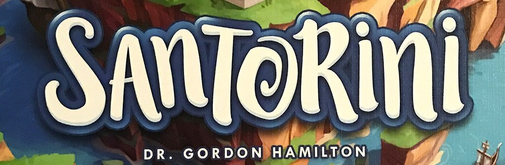
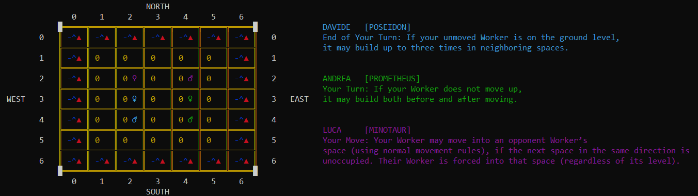

# Santorini


## About Santorini
>Santorini is an abstract strategy board game inspired by the architecture of Santorini Island in Greece. 
>Move your builders, rise to the top of the tower and take the glory. 
>Gods are looking, don't let them down!

>For 2-3 players. 5-15 minutes per match.

Game rules [here](https://www.ultraboardgames.com/santorini/game-rules.php).

## Index
* [Prerequisites](#prerequisites)
* [Requisites](#requirements)
* [Usage](#usage)
* [CLI Example](#cli-example)
* [Features Covered](#features-covered)
* [Built with](#built-with)
* [Authors](#authors)

## Prerequisites
This game requires at least [Java 11](https://www.java.com/it/download/) to run.

## Requirements
The project requirements can be found [here](ReadmeGameRequirements.pdf)

## Usage
The server must be up and running to play a game.

### Server
The following command is used to start a server:
```bash
java -jar Santorini.jar -server
```
Server can start from command line only.

### Client
The following command is used to start a client form command line:
```bash
java -jar Santorini.jar -client [-cli/-gui]
```
#### Options
* `-cli` if you want to use the Command Line Interface
* `-gui` if you want to use the Graphical User Interface
> Default mode is `-gui`. If you type
>```bash
>java -jar Santorini.jar -client
>```
> the client will start in GUI mode.

If you double click on the application, client in GUI mode will start.

## CLI Example


On the left part there is the board:
* the external cells represent the coast of Santorini isle;
* the 5x5 internal matrix represents the usable board. Each of these cells contains a number (the level of the tower) and a symbol (♂ for the male builder, ♀ for the female one). Each builder has the color of its corresponding player.

On the right part there is the ordered list of the players, each one with its color and the chosen God in square brackets.

## Features Covered
* Complete Rules
* Distributed System with MVC pattern
* Socket
* CLI
* GUI
* Advanced Gods
* Multiple Matches (one server can handle multiple matches simultaneously)

## Built with
* [IntelliJ IDEA](https://www.jetbrains.com/idea/)
* [Java](https://www.java.com/it/download/)
* [JavaFX](https://openjfx.io)
* [Maven](https://maven.apache.org)
* [Maven: Shade](https://maven.apache.org/plugins/maven-shade-plugin/)
* [JUnit](https://junit.org/junit4/)
* [External library: GSON](https://github.com/google/gson) used to serialize and deserialize messages in the network

## Authors
* [Andrea Manglaviti](https://github.com/AndreaMangla)
* [Davide Marinaro](https://github.com/davsailor)
* [Luca Marinello](https://github.com/LukeMari)